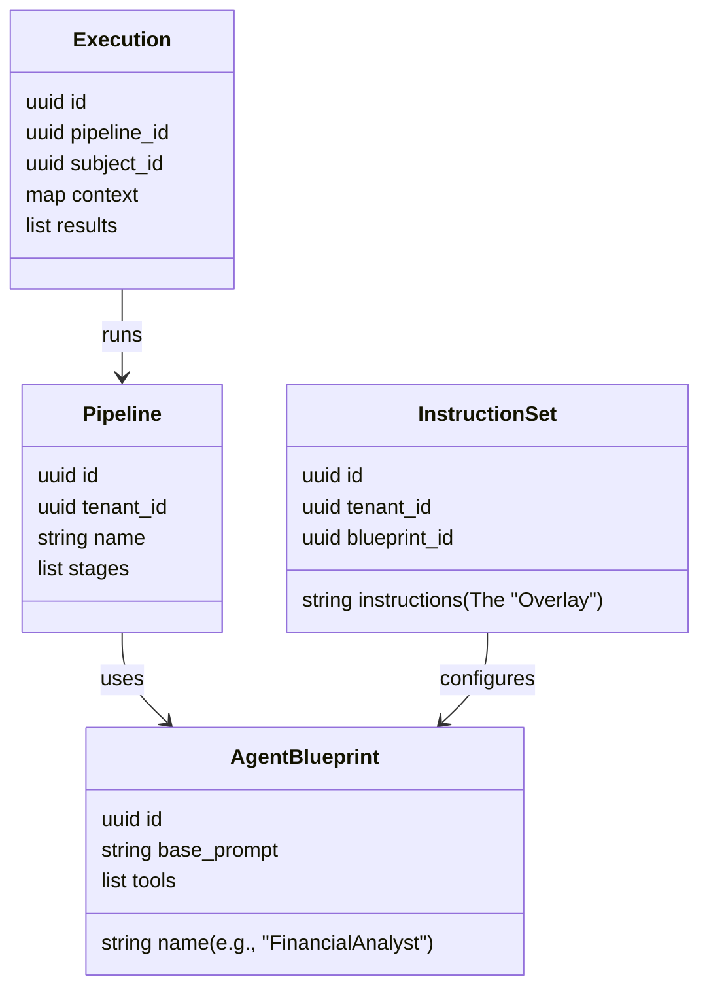

# Agentic UaaS Architecture

> **Status**: Draft **Version**: 2.0 (Agentic Pivot)

## 1. The Core Concept: Agentic Orchestration

We are moving away from simple "Dynamic Forms" to **Agentic Pipelines**. The
form is just one input vector; the core value is the **Orchestration of
Specialty Agents**.

### 1.1. The Domain Model

## 2. Key Components

### 2.1. Agent Blueprint (The "Skill")

Defines a generic capability.

- **Name**: `FinancialAnalyst`
- **Base Prompt**: "You are an expert underwriter. Your job is to analyze bank
  statements..."
- **Tools**: `extract_transactions`, `calculate_dscr`, `flag_nsf`.

### 2.2. Instruction Set (The "Training")

Defines the Tenant's specific policy. This is how a Tenant "trains" the generic
agent.

- **Tenant**: `BankOfAmerica`
- **Blueprint**: `FinancialAnalyst`
- **Instructions**:
  > "When calculating cash flow, exclude any deposits labeled 'Venmo' or
  > 'CashApp'. Only count W-2 income. Reject if NSF count > 3."

### 2.3. The Pipeline (The "Flow")

Defines the order of operations.

1. **Extraction Stage**: Run `DocExtractor` on all PDFs.
2. **Enrichment Stage**: Run `KycAgent` (Vendor API) and `WebCrawler` (Google
   Places).
3. **Analysis Stage**: Run `FinancialAnalyst` (using extracted data).
4. **Decision Stage**: Run `DecisionMaker` (synthesizes all findings into a
   Memo).

## 3. Implementation Roadmap

### Phase 1: The Core Pipeline (Immediate)

- [ ] **Schema Definition**: Create `AgentBlueprint`, `InstructionSet`, and
      `Pipeline` resources.
- [ ] **Orchestrator**: Build the engine that executes a Pipeline step-by-step.
- [ ] **Base Agents**: Implement the `MerchantAnalyst` blueprint (our current
      logic).

### Phase 2: The "Headless" API (Next Month)

- [ ] **Instruction API**: Allow Tenants to CRUD their `InstructionSets`.
- [ ] **Execution API**: `POST /assess` triggers the Pipeline.

### Phase 3: The Marketplace (Future)

- [ ] **Blueprint Library**: Allow 3rd party developers to publish Blueprints
      (e.g., "CryptoRiskAgent").
- [ ] **Shared Instructions**: "Clone the 'Conservative Bank' Instruction Set".

## 4. Technical Stack

- **Orchestration**: `Oban` (for reliable, async execution of agent steps).
- **Agent Runtime**: `LangChain` / `OpenAI API` (or local Llama 3 for simple
  tasks).
- **State Management**: `Ash` Resources (persisting the `Execution` state).
