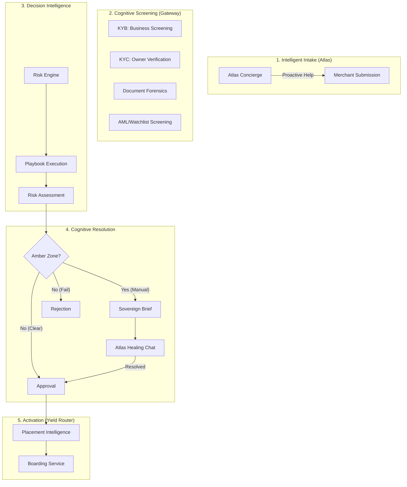

# Underwriting Engine: The Sovereign Cognitive Platform

## 🌟 Mission
To transform traditional "System of Record" underwriting into a **Sovereign Cognitive Decision Platform** through Human-Architected Playbooks, Autonomous Agentic Negotiation, and Multimodal Forensic Analysis.

## 🏗️ The Underwriting Pipeline

The MCP Underwriting Engine orchestrates a multi-stage cognitive pipeline that moves an application from submission to processor activation.

## 🚀 Key Capabilities

### 1. Merchant Atlas Concierge (Intelligent Intake)
- **Proactive Guidance**: Atlas tracks user behavior in real-time. If a merchant is stuck on the "EIN" field for 30 seconds, Atlas interjects with field-specific tax guidance.
- **Data Healing**: Instead of a "hard fail" on a vague business description, Atlas suggests improvements (e.g., "Tell us more about your target market") to increase the chance of auto-approval.
- **Data Quality**: Reduces "garbage-in, garbage-out" by validating input intent before the costly KYC/KYB screening begins.

### 2. Cognitive Screening & The Amber Zone
- **Multi-Vendor Orchestration**: Automatically routes between ComplyCube and Idenfy based on cost and success rates.
- **The "Amber Zone"**: Deals that aren't clear approvals or rejections are routed here. 
- **Asymmetric Negotiation**: In the Amber Zone, Atlas initiates an automated "Healing Chat" with the merchant to gather missing evidence, while the Underwriter reviews the **Sovereign Brief**.

### 3. Human-Architected Playbooks (Cognitive Control)
- **Playbook Concierge**: An AI assistant helps underwriters write complex risk policies in Markdown.
- **Immutable Lineage**: Every decision is tagged with a SHA-256 fingerprint of the exact rule-set used, ensuring absolute auditability.

### 4. Profit-Aware Routing (Yield Optimization)
- **Placement Intelligence**: Matches merchants to bank profiles with sub-5ms latency.
- **Yield Capture**: Dynamically routes based on the current "appetite" of our bank-processor matrix, capturing up to 10% more EBITDA.

## 📈 Strategic ROI
- **70% Underwriter Load Reduction**: Atlas handles doc-collection and merchant Q&A.
- **< 2 min Time-to-Board**: Real-time MID/TID generation for approved merchants.
- **Defensible Compliance**: 100% deterministic logic lineage for regulatory audits.

## 📖 Deep Dives
- **[Feature Catalog](feature-catalog.md)**: Full list of Merchant and Underwriter features with value propositions.
- **[Business Strategy](business-strategy.md)**: Business model, Pricing, and Competitive Matrix.
- **[UI/UX Architecture](ui-ux-architecture.md)**: The "Noir" Design System and Persona Workflows.
- **[Interactive Mocks](mocks/README.md)**: View high-fidelity HTML prototypes of the Engine in action.
- **[Developer Guide](developer-guide.md)**: Logic patterns, Engine internals, and Context Graph implementation.
- **[API Reference](api-reference.md)**: Resources, Service specs, and SHA-256 Lineage tracking.
- **[User Guide](user-guide.md)**: Operating the Sovereign Brief and Managing Playbooks.
- **[Stakeholder Guide](stakeholder-guide.md)**: Business value, The "Atlas" Vision, and Compliance ROI.
