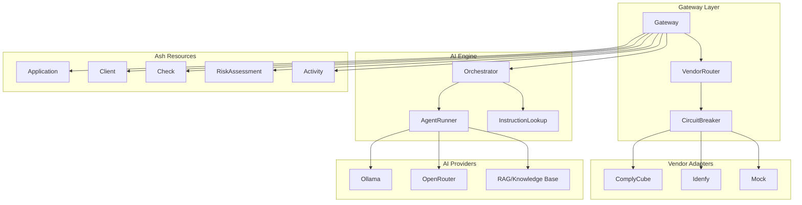

# Underwriting Engine

## Overview

The MCP Underwriting Engine is an AI-powered automated underwriting system that
performs KYC/KYB verification, risk assessment, and compliance screening. It
supports multiple vendor integrations (ComplyCube, Idenfy) with intelligent
fallback routing, circuit breaker protection, and comprehensive audit trails.

## Architecture



## Key Capabilities

- **Multi-Vendor KYC/KYB**: Seamless integration with ComplyCube and Idenfy
- **Intelligent Routing**: Automatic vendor selection with circuit breaker
  protection
- **AI-Powered Risk Assessment**: LLM-based analysis with RAG support
- **Multi-Tenant**: Full tenant isolation with context-based multitenancy
- **Comprehensive Audit Trail**: Activity logging for compliance
- **Watchlist Screening**: AML/PEP/Sanctions screening integration

## Quick Start

1. **Create an Application**

   ```elixir
   {:ok, app} = Ash.create(Application, %{
     subject_id: merchant_id,
     subject_type: :merchant,
     application_data: %{"business_name" => "Acme Corp"}
   }, tenant: tenant_schema)
   ```

2. **Screen the Application**

   ```elixir
   {:ok, risk_score} = Gateway.screen_application(app.id, tenant: tenant_schema)
   ```

3. **Check Results**

   ```elixir
   assessment = RiskAssessment
     |> Ash.Query.filter(application_id == ^app.id)
     |> Ash.read_one!(tenant: tenant_schema)
   ```

4. **Review Activity Log**

   ```elixir
   activities = Activity
     |> Ash.Query.filter(application_id == ^app.id)
     |> Ash.read!(tenant: tenant_schema)
   ```

## Core Components

| Component | Purpose |
|-----------|---------|
| **Gateway** | Entry point for all underwriting operations |
| **VendorRouter** | Selects optimal vendor based on config and circuit state |
| **CircuitBreaker** | Protects against vendor failures with automatic recovery |
| **Orchestrator** | Coordinates multi-stage AI agent pipelines |
| **AgentRunner** | Executes individual AI agents with smart routing |

## Related Features

- **[Specialty Agents](../agents/README.md)** - Agent blueprints and instruction sets
- **[RAG](../rag/README.md)** - Knowledge base integration for domain expertise
- **[LLM Strategy](../llms/README.md)** - Smart routing and provider configuration
- **[Multi-Tenancy](../multi-tenancy/README.md)** - Tenant isolation patterns

## Documentation

- **[Developer Guide](developer-guide.md)** - Technical implementation details
- **[API Reference](api-reference.md)** - Complete API documentation
- **[Stakeholder Guide](stakeholder-guide.md)** - Business value and compliance
- **[User Guide](user-guide.md)** - End user workflows and procedures
