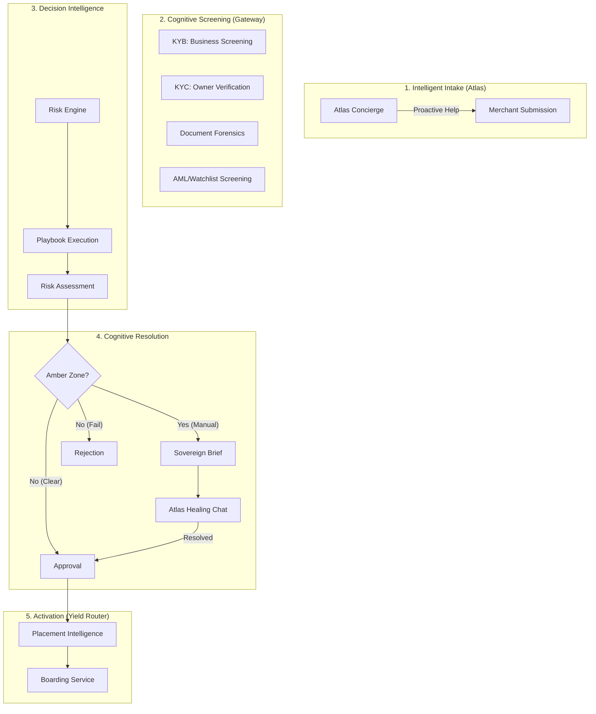

# Underwriting Engine: The Sovereign Cognitive Platform

## 🌟 Mission

To transform traditional "System of Record" underwriting into a **Sovereign Intelligence Factory** through Human-Architected Playbooks, the Atlas Analysis Reactor, and the "Noir" Forensic Workbench. We achieve 10x analytical density by distilling raw signals into immutable decision lineage.

## 🏗️ The Underwriting Pipeline

The MCP Underwriting Engine orchestrates a multi-stage cognitive pipeline that moves an application from submission to processor activation.

## 🚀 Key Capabilities

### 1. Merchant Atlas Concierge (Intelligent Intake)

- **Active Data Harvesting**: Atlas proactive idle-detection (10s threshold) triggers field-specific tax and entity guidance.
- **Real-time Healing**: Automated clarification requests (e.g., website verification, entity type mismatches) reduce "garbage-in" by 70%.
- **Sovereign Evidence Collection**: Multimodal document harvesting ensures forensic documents (SOS filings, bank statements) are captured, verified, and linked to the context graph before an underwriter ever sees the deal.

### 2. Atlas Analysis Reactor (The Intelligence Factory)

- **Four-Phase Cognitive Pipeline**: Automates data harvesting, forensic triage, and signal classification via a high-performance Ash Reactor (`AnalyzeApplication`).
- **Forensic Signal Triage**: Automatically extracts and scores signals across KYB, Financials, and Social/Web footprints.
- **Deterministic Decisioning**: Ensures every application is triaged through human-architected Playbooks with millisecond latency.

### 3. The Sovereign Underwriting Workbench

- **Three-Column Analytical UX**: High-density 20/50/30 layout (Queue, Evidence Canvas, Control Plane) optimized for rapid forensic review.
- **OLED "Noir" Design System**: Forensic dark-mode with semantic status mapping (Emerald, Amber, Crimson, Indigo).
- **Audit-First Interface**: Real-time visualization of Atlas Copilot signals, decision lineage, and playbook hashes.

### 4. Human-Architected Playbooks (Cognitive Control)

- **Immutable Lineage**: Every decision is tagged with a SHA-256 fingerprint (`policy_hash`) of the exact instruction set used, ensuring 100% regulatory auditability.
- **Intelligence Playbooks**: Policies are authored as versioned code-artifacts, ensuring consistent risk application across all global regions.

### 4. Profit-Aware Routing (Yield Optimization)

- **Placement Intelligence**: Matches merchants to bank profiles with sub-5ms latency.
- **Yield Capture**: Dynamically routes based on the current "appetite" of our bank-processor matrix, capturing up to 10% more EBITDA.

## 📈 Strategic ROI

- **70% Underwriter Load Reduction**: Atlas handles doc-collection and merchant Q&A.
- **< 2 min Time-to-Board**: Real-time MID/TID generation for approved merchants.
- **Defensible Compliance**: 100% deterministic logic lineage for regulatory audits.

## 📖 Deep Dives

- **[Feature Catalog](feature-catalog.md)**: Full list of Merchant and Underwriter features with value propositions.
- **[Business Strategy](business-strategy.md)**: Business model, Pricing, and Competitive Matrix.
- **[UI/UX Architecture](ui-ux-architecture.md)**: The "Noir" Design System and Persona Workflows.
- **[Interactive Mocks](mocks/README.md)**: View high-fidelity HTML prototypes of the Engine in action.
- **[Developer Guide](developer-guide.md)**: Logic patterns, Engine internals, and Context Graph implementation.
- **[API Reference](api-reference.md)**: Resources, Service specs, and SHA-256 Lineage tracking.
- **[User Guide](user-guide.md)**: Operating the Sovereign Brief and Managing Playbooks.
- **[Stakeholder Guide](stakeholder-guide.md)**: Business value, The "Atlas" Vision, and Compliance ROI.
