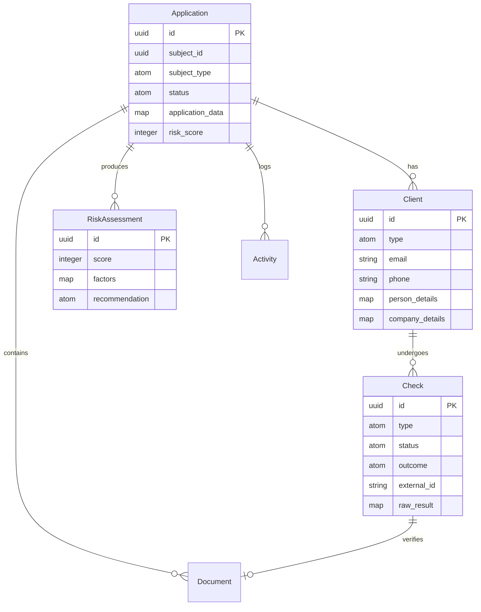

# Developer Guide: Underwriting Engine

## Architecture

The underwriting system is built on the **Ash Framework** with a layered
architecture that separates concerns between vendor integration, AI processing,
and data persistence.

### Module Structure

```
lib/mcp/underwriting/
├── gateway.ex              # Main entry point
├── vendor_router.ex        # Vendor selection logic
├── circuit_breaker.ex      # Fault tolerance
├── adapter.ex              # Behaviour definition
├── adapters/
│   ├── comply_cube.ex      # ComplyCube integration
│   ├── idenfy.ex           # Idenfy integration
│   └── mock.ex             # Testing adapter
├── engine/
│   ├── orchestrator.ex     # Pipeline execution
│   ├── agent_runner.ex     # LLM integration
│   └── instruction_lookup.ex
├── resources/
│   ├── application.ex      # Underwriting application
│   ├── client.ex           # KYC subject (person/company)
│   ├── check.ex            # Verification check results
│   ├── risk_assessment.ex  # Risk scoring
│   ├── activity.ex         # Audit trail
│   ├── document.ex         # Document storage
│   └── ...
└── jobs/
    └── run_pipeline.ex     # Oban async job
```

## Data Model

### Core Resources



### Multitenancy

All underwriting resources use **context-based multitenancy**:

```elixir
defmodule Mcp.Underwriting.Application do
  use Ash.Resource,
    domain: Mcp.Underwriting,
    data_layer: AshPostgres.DataLayer

  multitenancy do
    strategy :context
  end
end
```

Always pass the tenant when performing operations:

```elixir
# Creating with tenant
Ash.create!(Application, attrs, tenant: tenant_schema)

# Reading with tenant
Ash.read!(Application, tenant: tenant_schema)

# Using code_interface
Client.get_by_email(email, tenant: tenant_schema)
```

## Gateway Operations

### Screen Application

The primary entry point for underwriting:

```elixir
def screen_application(application_id, opts \\ []) do
  tenant = Keyword.get(opts, :tenant)

  with {:ok, application} <- fetch_application(application_id, tenant),
       {:ok, _kyb} <- run_kyb_check(application, tenant),
       {:ok, _kyc_results} <- process_owner_kyc(application, tenant),
       {:ok, score} <- calculate_risk_score(application, tenant),
       {:ok, _} <- update_application_status(application, score, tenant) do
    {:ok, score}
  end
end
```

### Error Handling

KYC errors are properly propagated using `Enum.reduce_while`:

```elixir
defp process_owner_kyc_checks(application, owners, adapter, tenant) do
  Enum.reduce_while(owners, {:ok, []}, fn owner, {:ok, acc} ->
    case call_adapter(adapter, :verify_identity, [owner, %{}]) do
      {:ok, kyc_result} ->
        {:ok, check} = record_kyc_check(client, :complete, kyc_result, tenant)
        {:cont, {:ok, [{:ok, check, kyc_result} | acc]}}

      {:error, reason} ->
        log_kyc_failure_activity(application, owner, reason, tenant)
        {:halt, {:error, {:kyc_failed, owner["email"], reason}}}
    end
  end)
end
```

## Vendor Integration

### Adapter Behaviour

All vendor adapters implement the `Mcp.Underwriting.Adapter` behaviour:

```elixir
defmodule Mcp.Underwriting.Adapter do
  @callback verify_identity(map(), map()) :: {:ok, map()} | {:error, term()}
  @callback verify_business(map(), map()) :: {:ok, map()} | {:error, term()}
  @callback check_watchlist(String.t(), map()) :: {:ok, map()} | {:error, term()}
end
```

### Implementing an Adapter

```elixir
defmodule Mcp.Underwriting.Adapters.ComplyCube do
  @behaviour Mcp.Underwriting.Adapter

  @impl true
  def verify_identity(person, _context) do
    # API call to ComplyCube
  end

  @impl true
  def verify_business(business, _context) do
    # API call to ComplyCube
  end

  @impl true
  def check_watchlist(name, context) do
    # Watchlist screening
  end
end
```

### Vendor Router

The VendorRouter selects the appropriate adapter:

```elixir
def select_adapter(_context \\ %{}) do
  adapter = determine_adapter()

  case CircuitBreaker.check_circuit(service_name(adapter)) do
    :ok -> adapter
    {:error, :circuit_open} -> get_fallback_adapter(adapter)
  end
end
```

Configuration priority:
1. `Application.get_env(:mcp, :underwriting_adapter)` - Explicit adapter
2. `Application.get_env(:mcp, :preferred_vendor)` - Preferred vendor
3. `System.get_env("COMPLY_CUBE_API_KEY")` - Auto-detect from API keys

### Circuit Breaker

Protects against vendor failures:

```elixir
# Check before calling
case CircuitBreaker.check_circuit("ComplyCube") do
  :ok -> make_api_call()
  {:error, :circuit_open} -> use_fallback()
end

# Report outcomes
CircuitBreaker.report_success("ComplyCube")
CircuitBreaker.report_failure("ComplyCube")

# Reset for testing
CircuitBreaker.reset("ComplyCube")
```

Configuration:
- **Failure Threshold**: 5 failures to open circuit
- **Reset Timeout**: 60 seconds before attempting recovery

## AI Engine

### Orchestrator

Executes multi-stage pipelines:

```elixir
def run_pipeline(execution_id, opts \\ []) do
  tenant = Keyword.get(opts, :tenant)

  execution = Ash.get!(Execution, execution_id, tenant: tenant)
              |> Ash.load!(:pipeline, tenant: tenant)

  results = Enum.reduce(pipeline.stages, %{}, fn stage, acc ->
    blueprint = Ash.get!(AgentBlueprint, stage["blueprint_id"], tenant: tenant)
    instructions = InstructionLookup.find(blueprint.id, tenant)

    {:ok, output} = AgentRunner.run(blueprint, instructions, context, opts)
    Map.put(acc, blueprint.name, output)
  end)

  # Update execution with results
  Ash.update!(execution, %{status: :completed, results: results}, tenant: tenant)
end
```

### Agent Runner

Executes individual agents with smart routing:

```elixir
def run(blueprint, instructions, context, opts) do
  # Rate limit check
  case RateLimiter.check_limit("tenant:#{tenant_id}", 100) do
    :ok -> execute_agent_run(...)
    {:error, :rate_limit_exceeded} -> {:ok, %{"error" => "Rate limited"}}
  end
end
```

Features:
- **Smart Routing**: Primary/fallback provider configuration
- **Confidence-Based Fallback**: Falls back if confidence < threshold
- **RAG Integration**: Enriches prompts with knowledge base content
- **Semantic Cache**: Caches responses for similar queries
- **Usage Tracking**: Records token usage per execution

### RAG Integration

Agents can use knowledge bases for domain expertise:

```elixir
# Blueprint with knowledge base IDs
blueprint = %AgentBlueprint{
  name: "MortgageUnderwriter",
  base_prompt: "You are a mortgage underwriting expert.",
  knowledge_base_ids: ["kb_mortgage_guidelines", "kb_compliance"]
}

# RAG enrichment happens automatically in AgentRunner
defp enrich_prompt_with_rag(system_prompt, messages, kb_ids, tenant_id) do
  context = retrieve_rag_context(query, tenant_id, kb_ids)
  system_prompt <> "\n\nRelevant Context:\n" <> context
end
```

## Configuration

### Environment Variables

```bash
# Vendor API Keys
COMPLY_CUBE_API_KEY=xxx
COMPLY_CUBE_API_SECRET=xxx
IDENFY_API_KEY=xxx
IDENFY_API_SECRET=xxx

# LLM Configuration
OLLAMA_PORT=11434
OLLAMA_MODEL=llama3
OPENROUTER_API_KEY=xxx
```

### Application Config

```elixir
# config/config.exs
config :mcp, :underwriting_adapter, :complycube  # or :idenfy, :mock
config :mcp, :preferred_vendor, :comply_cube

config :mcp, :ollama,
  port: System.get_env("OLLAMA_PORT", "11434"),
  model: System.get_env("OLLAMA_MODEL", "llama3")

config :mcp, :llm,
  openrouter_api_key: System.get_env("OPENROUTER_API_KEY"),
  openrouter_base_url: "https://openrouter.ai/api/v1",
  openrouter_model: "openai/gpt-4-turbo"
```

## Testing

### Unit Tests

```elixir
defmodule Mcp.Underwriting.GatewayTest do
  use Mcp.DataCase

  setup do
    # Create tenant
    tenant = create_tenant()

    # Configure mock adapter
    Application.put_env(:mcp, :underwriting_adapter, :mock)

    {:ok, tenant: tenant.company_schema}
  end

  test "screens application successfully", %{tenant: tenant} do
    app = create_application(tenant)
    assert {:ok, score} = Gateway.screen_application(app.id, tenant: tenant)
    assert score >= 0 and score <= 100
  end
end
```

### Integration Tests

```elixir
@tag :external_api
test "integration with ComplyCube", %{tenant: tenant} do
  Application.put_env(:mcp, :underwriting_adapter, :complycube)

  app = create_application(tenant)
  result = Gateway.screen_application(app.id, tenant: tenant)

  assert {:ok, _score} = result
end
```

### Circuit Breaker Reset

For test isolation, reset circuit breakers in setup:

```elixir
setup do
  CircuitBreaker.reset("Elixir.Mcp.Underwriting.Adapters.ComplyCube")
  CircuitBreaker.reset("Elixir.Mcp.Underwriting.Adapters.Idenfy")
  Process.sleep(10)  # Allow async cast to process
  :ok
end
```

## Debugging

### Telemetry Events

The system emits telemetry events:

```elixir
# Agent completion
[:ai, :agent, :completion]
  measurements: %{latency: ms, total_tokens: n, cost: decimal}
  metadata: %{blueprint: name, provider: atom, model: string, cached: bool}
```

### Logging

Enable verbose mode in AgentRunner:

```elixir
LLMChain.new!(%{llm: llm, verbose: true})
```

### Common Issues

1. **Tenant Required Error**: Ensure tenant is passed to all Ash operations
2. **Circuit Open**: Check CircuitBreaker state with `CircuitBreaker.check_circuit/1`
3. **Rate Limit**: Check `RateLimiter.check_limit/2` for tenant limits
4. **RAG Empty Results**: Verify knowledge base IDs exist and have documents
