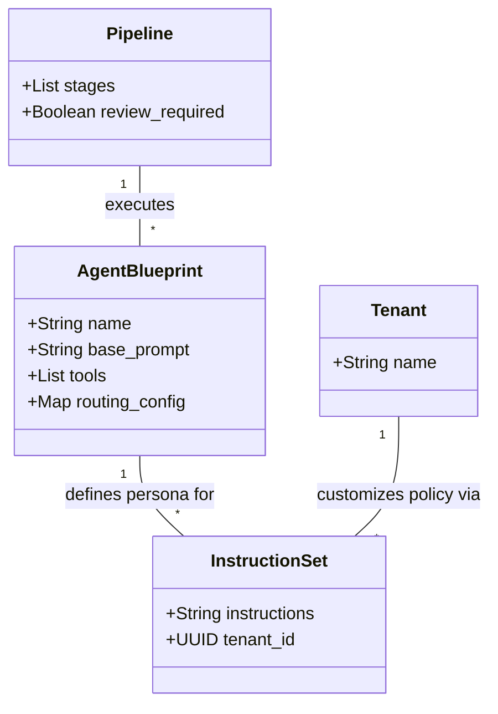

# Specialty Agents

## Overview

The MCP platform utilizes a **Database-Driven Agentic Architecture**. Instead of
hardcoding agent logic into the application code, we define agents as data
records (`AgentBlueprint`) and their specific behaviors as policy records
(`InstructionSet`).

This approach allows for dynamic creation, modification, and tuning of AI agents
without requiring code deployments.

## Architecture

## Core Concepts

- **Agent Blueprint**: Defines the "Persona" of the agent. It includes the base
  system prompt, available tools, and routing configuration.
- **Instruction Set**: Defines the "Policy" or specific task instructions.
  Different tenants can have different instruction sets for the same blueprint,
  enabling multi-tenant customization.
- **Orchestrator**: The engine that reads these records and executes the agent
  workflow.

## Key Capabilities

- **Dynamic Personas**: Create a "Financial Analyst" or "Compliance Officer"
  simply by adding a record.
- **Multi-Tenant Policies**: Tenant A can have strict risk rules, while Tenant B
  has lenient ones, all using the same underlying "Underwriter" agent.
- **Version Control**: Blueprints and Instruction Sets are versioned
  (conceptually) allowing for safe iteration.

## Quick Start

1. **Define a Blueprint**: Create an `AgentBlueprint` record (e.g., "Loan
   Processor").
2. **Add Instructions**: Create an `InstructionSet` linked to that blueprint
   (e.g., "Check for missing fields").
3. **Configure Pipeline**: Add the blueprint to a `Pipeline` stage.
4. **Run**: The system automatically loads the correct instructions for the
   tenant and executes the agent.

## The Agent Architect

The platform includes a specialized meta-agent called the **Agent Architect**.
This agent is designed to help you build other agents.

- **Role**: Expert AI Systems Designer.
- **Capabilities**: Interviews you about your requirements and generates the
  optimal `AgentBlueprint` and `InstructionSet` configuration (JSON/Elixir).
- **Usage**: Chat with the Agent Architect to prototype new personas before
  deploying them.

## The Response Reviewer

The platform also includes a **Response Reviewer** (Guardrails Agent).

- **Role**: Compliance Officer & Safety Guard.
- **Function**: Intercepts the final output of any pipeline execution to check
  for PII, tone, and safety.
- **Configuration**: Enable by setting `review_required: true` on the `Pipeline`
  resource.

## Retrieval-Augmented Generation (RAG)

Agents can be "trained" with domain-specific knowledge using **Knowledge
Bases**.

For full documentation on configuring and using RAG, see the
**[RAG Documentation](../rag/README.md)**.

## Available Agents

The platform comes pre-seeded with a suite of specialty agents:

### Core Underwriting

- **MerchantUnderwriter**: Analyzes business applications, cash flow, and risk.
- **The Eye**: OCR and document extraction specialist.
- **FraudDetective**: Investigates anomalies and potential fraud.

### Multi-Vertical

- **MortgageUnderwriter**: Residential mortgage risk assessment (DTI, LTV,
  Credit).
- **AutoLoanUnderwriter**: Vehicle financing risk assessment (PTI, LTV,
  Depreciation).
- **RentalScreener**: Tenant screening (Evictions, Rent-to-Income).

### System

- **AgentArchitect**: Helps you design new agents.
- **ResponseReviewer**: Guardrails for safety and compliance.
