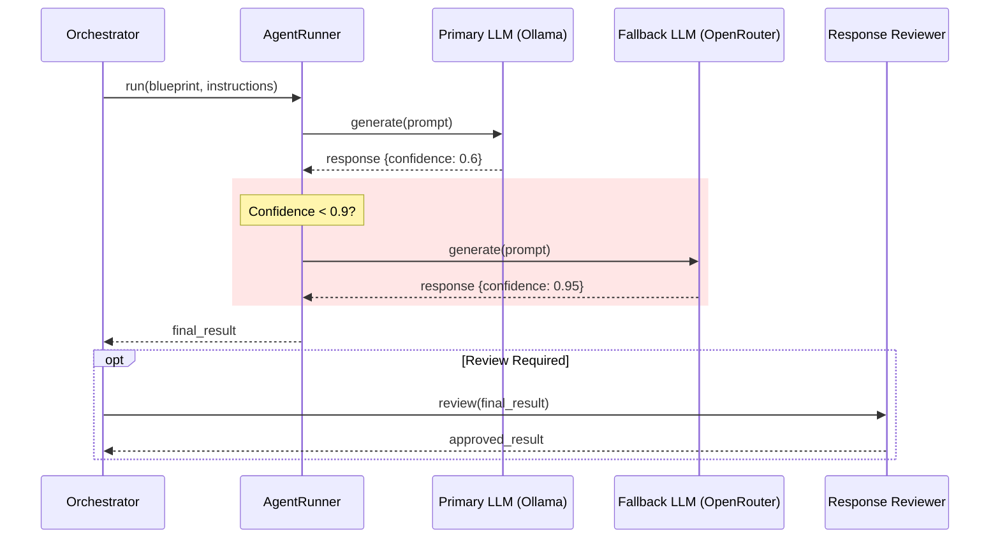

# Developer Guide: Specialty Agents

## Architecture

The agent system is built on the **Ash Framework**, utilizing resources to model
the agent configuration.

### Data Model

- **`Mcp.Underwriting.AgentBlueprint`**: The parent resource.
  - `name`: Unique identifier (e.g., "FinancialAnalyst").
  - `base_prompt`: The core personality (e.g., "You are an expert financial
    analyst...").
  - `tools`: List of tools the agent can access (e.g.,
    `[:calculator, :web_search]`).
  - `routing_config`: Smart routing settings.

- **`Mcp.Underwriting.InstructionSet`**: The child resource.
  - `blueprint_id`: FK to the blueprint.
  - `tenant_id`: (Optional) Scopes instructions to a specific tenant.
  - `instructions`: The specific task rules (e.g., "Reject if DTI > 40%").

## Creating a New Agent

To add a new specialty agent, you don't write Elixir code. You seed the
database.

```elixir
# seeds.exs

blueprint = Ash.create!(AgentBlueprint, %{
  name: "RiskOfficer",
  base_prompt: "You are a senior risk officer. Analyze the application for fraud signals.",
  tools: [:identity_verification],
  routing_config: %{mode: :single, primary_provider: :ollama}
})

Ash.create!(InstructionSet, %{
  blueprint_id: blueprint.id,
  instructions: "Flag any application where the IP address country does not match the residence address."
})
```

## Integration with Orchestrator

The `Orchestrator` dynamically loads agents based on the `Pipeline`
configuration.

1. It reads the `Pipeline` stages (list of blueprint IDs).
2. For each stage, it fetches the `AgentBlueprint`.
3. It fetches the `InstructionSet` that matches the current `tenant_id` (or
   falls back to a global default).
4. It combines `base_prompt` + `instructions` to form the full system prompt.
5. It passes this to the `AgentRunner`.

### Execution Flow


